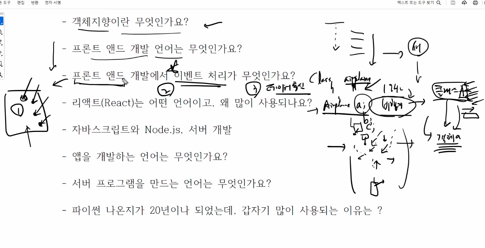

---
title: 개발자 기본 지식 (docx export)
source: 07_hub/HQ_Shared/scans/personal/kenny-study-scan/5162026 개발자 기본 지식.docx
exported: 2026-05-16
method: pandoc
images: 2 (./media/)
---
5/16/2026 개발자 기본 지식

Saturday, May 16, 2026

9:40 PM

 

Level1 start

 

 

 

 

시작

frontend react.js

Backend node.js

이후 발전\
java\
springboot

Migration

 

 

React 가 실제로 많이 쓰임. 객체지향

 

Class -\> skill, subagent

Object -\> 발화된 클래스

Object1, classA\
object2, classB\
\
등등

여기에

Inheritance -\> claude.md cascading.

그리고 뭐가 더 있네. 내가 인지 하지못하고 있는.\
\
스킬 개발 서브에이전트 개발전에\
객체지향언어의 속성 필요.

 

 

프론트 엔드

1.  화면이쁘게 그리기.

2.  이벤트 처리

3.  데이터 통신 ajax? Axios? 이게 뭐지 어렵다는데.\
    이거가 본질인네. 나는 가능한 claude environment만들고 싶어. Claude design아직 뭔지 모르고. React 도 잘몰라. 한번 프로젝트 하면서 경험해보고 싶어.

 

 

Python 데이터 분석, 인공지능, 빅데이터\
분석에 좋다는데. 뭐가 좋지?\
서버도 되고 분석도 된다는데, node랑 다른가?

 

 

 

 

지도개념의\
내가 만드려는것의 프로토타입보여주고\
어느 테크트리 어떤 리소스가 필요한가?

 

이거 스킬화 필요.

 

React Native\
\
webapp?

 

q.technote.wiki

 

Level1 end level2 start
